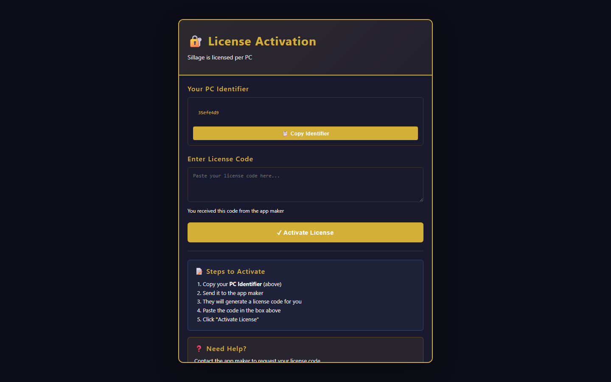

# Younes Mahboubi

### Business systems developer · Algeria 🇩🇿

I build custom desktop and web software that turns repetitive administrative work into clear, reliable workflows.

## What I build

- Custom automation for **HR, procurement, inventory, POS, and document workflows**
- Practical software for operations teams: desktop tools, web apps, and internal dashboards
- Systems shaped by **5+ years in procurement, HR, and operations** before moving into development
- Focused, maintainable tools with **no dependency on paid third-party AI APIs**

## Featured projects

- **[Sillage — PerfumierPro](https://mahboubi-younes.github.io/sillage-perfumierpro-demo/)** — activation-gated retail operations demo for perfume shops: POS, inventory, loyalty, sales history, and reporting.
- **[RH Manager Pro](https://mahboubi-younes.github.io/rh-manager-demo/)** — interactive HR workflow demo for Algerian businesses: employee records, leave, payroll estimates, and reporting.
- **[PerfumierPro customer history](https://github.com/mahboubi-younes/ParfumHistory)** — QR-friendly purchase-history companion that helps perfume retailers serve returning customers faster.

## Project snapshots

### RH Manager Pro

### Sillage — PerfumierPro

## Tech stack

## Let’s talk

- [LinkedIn](https://www.linkedin.com/in/younes-mahboubi/)
- Guru.com profile: link coming soon
