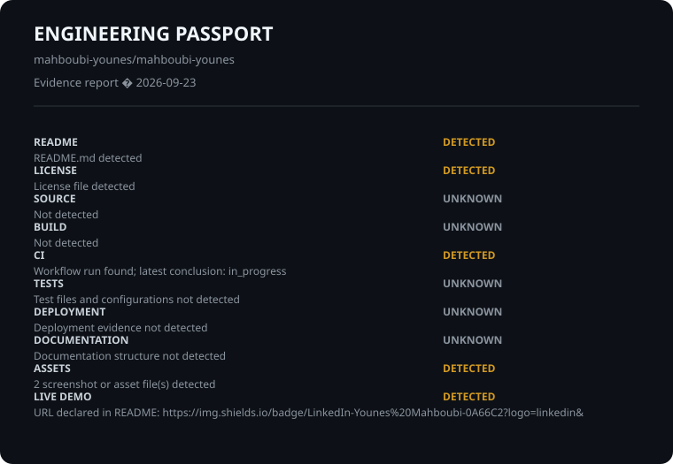

# Engineering Passport

Repository: mahboubi-younes/mahboubi-younes

Evidence-first report. This is not a quality score or ranking.

## Evidence

- **README** | DETECTED | README.md detected
- **LICENSE** | DETECTED | License file detected
- **SOURCE** | DETECTED | Source files detected
- **BUILD** | UNKNOWN | Evidence unavailable
- **CI** | VERIFIED | Latest non-Passport workflow succeeded on 2026-09-22T15:53:06Z
- **TESTS** | UNKNOWN | No test files or test configuration detected in the repository
- **DEPLOYMENT** | UNKNOWN | Deployment evidence not detected
- **DOCUMENTATION** | UNKNOWN | Documentation structure not detected
- **ASSETS** | DETECTED | 3 screenshot or asset file(s) detected
- **LIVE DEMO** | UNKNOWN | Live demo URL not detected

## Technologies

JavaScript

## Verification context

- Generated: 2026-09-23T12:16:39.227Z
- GitHub API: Repository metadata read from GitHub API

Unknown means evidence was unavailable; no claim is made.
